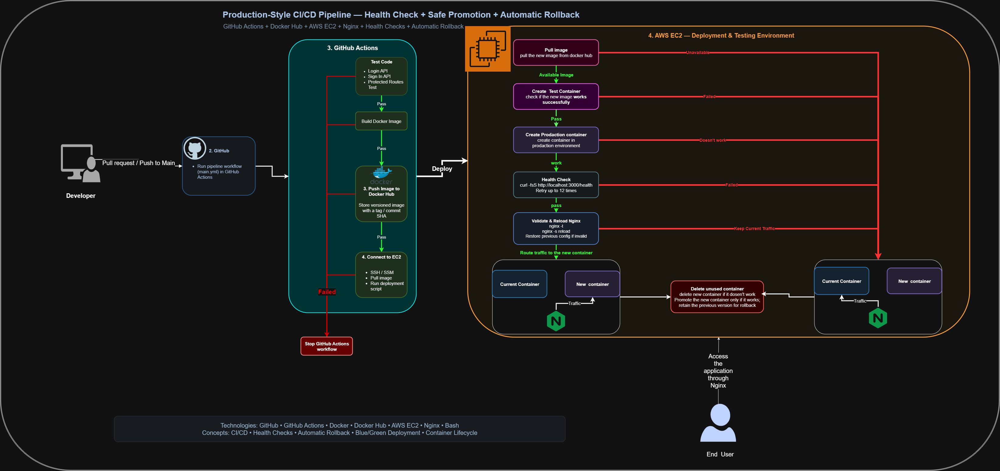

Markdown
# To-Do & Habit Tracker Application

A full-stack web application designed for daily habit tracking and monthly progress monitoring, complete with a secure user authentication system and relational database storage.

---

## Key Features
* **Isolated User Accounts:** Multi-user support allowing new users to sign up securely, ensuring each account manages its own private habits and tracking records.
* **Secure Authentication:** User registration and login functionality with password hashing.
* **Habit Management:** Add, track, and manage custom daily habits.
* **Monthly Progress Dashboard:** Visual representation of your performance and progress over the course of the month.
* **Interactive Frontend:** Built with vanilla HTML, CSS, and JavaScript for a responsive and smooth user experience.

---

## Tech Stack
* **Frontend:** HTML5, CSS3, JavaScript
* **Backend:** Node.js, Express.js
* **Database:** MySQL

---

## Project Structure
```
todo-habit-app/
│
├── front-end/                # Frontend files (HTML, CSS, Client JS)
│   ├── login.html
│   ├── habits.html
│   └── 
│
├── deployement/
│   └── deployment.sh        #deployement file in EC2 server
├──.github/workflows/
│   ├── main.yml            #The pipeline script in git actions
│   └── sql-test.yml
├── server.js                # Backend application logic
├── package.json             
├── server.test.js          
├── .dockerfile               
├── .dockerignore             
├── .gitignore
├── pipeline.png
└── README.md
```

## The pipe line


---
<details>
<summary/>How to Install
Prerequisites</summary>
Make sure you have the following installed on your machine:

Node.js (v18 or newer)

MySQL Server

Database Setup
Run the following SQL commands in your MySQL database management tool (like MySQL Workbench or phpMyAdmin) to set up the required tables:

```SQL
CREATE TABLE users (
    id INT AUTO_INCREMENT PRIMARY KEY,
    username VARCHAR(50) NOT NULL UNIQUE,
    password_hash VARCHAR(255) NOT NULL,
    created_at TIMESTAMP DEFAULT CURRENT_TIMESTAMP
);

CREATE TABLE habits (
    id INT AUTO_INCREMENT PRIMARY KEY,
    user_id INT NOT NULL,
    title VARCHAR(100) NOT NULL,
    created_at TIMESTAMP DEFAULT CURRENT_TIMESTAMP,
    FOREIGN KEY (user_id) REFERENCES users(id) ON DELETE CASCADE
);

CREATE TABLE habit_logs (
    id INT AUTO_INCREMENT PRIMARY KEY,
    habit_id INT NOT NULL,
    log_date DATE NOT NULL,
    is_completed BOOLEAN DEFAULT TRUE,
    created_at TIMESTAMP DEFAULT CURRENT_TIMESTAMP,
    -- Prevents duplicate logs for the same habit on the same day
    UNIQUE KEY unique_habit_date (habit_id, log_date),
    FOREIGN KEY (habit_id) REFERENCES habits(id) ON DELETE CASCADE
);
```
Installation & Setup
Clone the Repository:

```Bash
git clone [https://github.com/your-username/todo-habit-app.git](https://github.com/your-username/todo-habit-app.git)
cd todo-habit-app
```
Install Dependencies:
```Bash
npm install
```
Configure Environment Variables:
Create a .env file in the root directory of your project and configure your environment details:

```
PORT=3000
DB_HOST=localhost
DB_USER=root
DB_PASSWORD=your_password
DB_NAME=your_database_name
JWT_SECRET=your_jwt_secret_key
Run the Application:
```
To run tests (if configured):

```Bash
npm test
```
To start the application server:
```Bash
npm start
```
Open your browser and navigate to: http://localhost:3000
Contribution
Contributions are welcome! Feel free to fork the repository and submit a Pull Request for any improvements.
<details>

